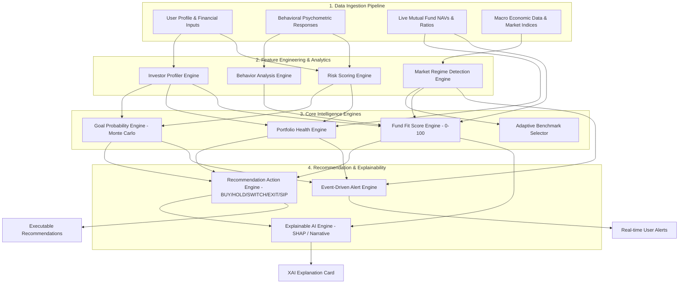
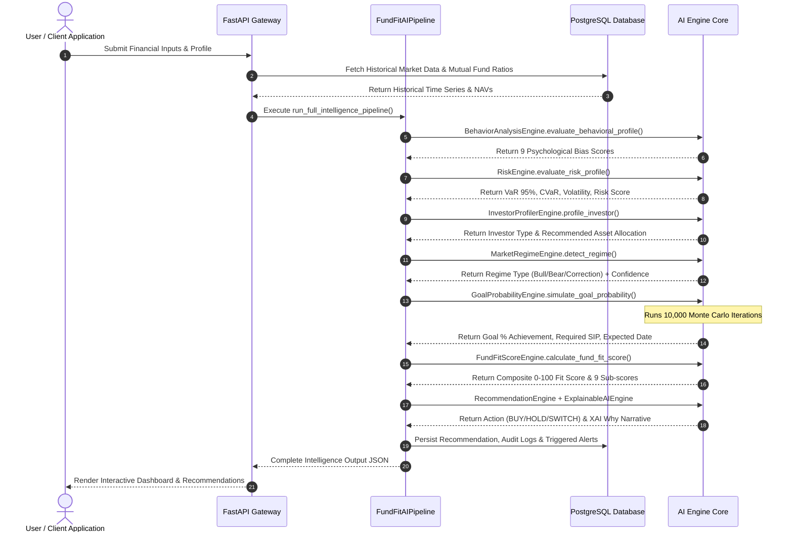

# FUND FIT AI - Enterprise Database Architecture & AI Engine Specification

## 1. System Overview

**FUND FIT AI** is an enterprise-grade AI-powered Mutual Fund Intelligence Platform designed for financial institutions, wealth management firms, retail investors, and advisors. The platform combines 3NF PostgreSQL relational schemas with real-time financial quantitative modeling, stochastic Monte Carlo simulations, regime detection, and Explainable AI (XAI).

---

## 2. Complete Entity-Relationship (ER) Diagram (29 Tables)

```mermaid
erDiagram
    USERS ||--o| INVESTOR_PROFILES : "has profile"
    USERS ||--o| BEHAVIOR_PROFILES : "has behavior profile"
    USERS ||--o{ RISK_ASSESSMENTS : "completes"
    USERS ||--o{ GOALS : "sets"
    USERS ||--o{ PORTFOLIOS : "owns"
    USERS ||--o{ RECOMMENDATIONS : "receives"
    USERS ||--o{ RECOMMENDATION_HISTORY : "tracks"
    USERS ||--o{ WATCHLISTS : "maintains"
    USERS ||--o{ ALERTS : "receives"
    USERS ||--o{ NOTIFICATIONS : "receives"
    USERS ||--o{ REPORTS : "generates"
    USERS ||--o{ USER_SESSIONS : "authenticates"
    USERS ||--o{ API_KEYS : "owns"
    USERS ||--o{ SETTINGS : "configures"

    ADVISOR_CLIENTS }|--|| USERS : "advisor"
    ADVISOR_CLIENTS }|--|| USERS : "client"

    GOALS ||--o{ GOAL_PROGRESS : "tracks progress"

    AMC ||--o{ MUTUAL_FUNDS : "issues"
    FUND_CATEGORIES ||--o{ MUTUAL_FUNDS : "classifies"
    BENCHMARKS ||--o{ MUTUAL_FUNDS : "benchmarks"
    BENCHMARKS ||--o{ BENCHMARK_HISTORY : "records history"

    MUTUAL_FUNDS ||--o{ PORTFOLIO_HOLDINGS : "held in"
    MUTUAL_FUNDS ||--o{ TRANSACTIONS : "traded in"
    MUTUAL_FUNDS ||--o{ WATCHLISTS : "watched in"
    MUTUAL_FUNDS ||--o{ DOCUMENTS : "has documents"

    PORTFOLIOS ||--o{ PORTFOLIO_HOLDINGS : "contains"
    PORTFOLIOS ||--o{ TRANSACTIONS : "logs"
    PORTFOLIOS ||--o{ REPORTS : "summarized in"

    ADMIN_LOGS }|--|| USERS : "executed by admin"
    AUDIT_LOGS }|--o| USERS : "changed by"

    USERS {
        uuid id PK
        string email UK
        string hashed_password
        string full_name
        string role
        boolean is_active
        boolean is_verified
        timestamptz created_at
        timestamptz updated_at
        timestamptz deleted_at
    }

    INVESTOR_PROFILES {
        uuid id PK
        uuid user_id FK
        int age
        string occupation
        numeric salary
        numeric monthly_income
        numeric monthly_expenses
        numeric assets
        numeric liabilities
        numeric net_worth
        numeric emergency_fund
        string investment_experience
        string financial_knowledge
        string tax_bracket
        string liquidity_need
        int dependents
        string risk_preference
        string behavior_profile
        text investment_goals
        string time_horizon
    }

    BEHAVIOR_PROFILES {
        uuid id PK
        uuid user_id FK
        numeric loss_aversion
        numeric overconfidence
        numeric anchoring_bias
        numeric recency_bias
        numeric herd_mentality
        numeric emotional_investing
        numeric patience
        string decision_style
        numeric confidence_level
    }

    RISK_ASSESSMENTS {
        uuid id PK
        uuid user_id FK
        numeric risk_score
        string risk_category
        numeric downside_risk
        numeric expected_volatility
        numeric drawdown_tolerance
        jsonb assessment_answers
    }

    GOALS {
        uuid id PK
        uuid user_id FK
        string title
        string category
        numeric target_amount
        numeric current_amount
        date target_date
        string priority
        string status
    }

    GOAL_PROGRESS {
        uuid id PK
        uuid goal_id FK
        date snapshot_date
        numeric achieved_amount
        numeric achievement_percentage
        numeric required_sip
        numeric required_investment
        date expected_completion_date
    }

    MUTUAL_FUNDS {
        uuid id PK
        string scheme_code UK
        string fund_name
        uuid amc_id FK
        uuid category_id FK
        uuid benchmark_id FK
        numeric nav
        numeric expense_ratio
        numeric aum
        string risk_level
        numeric return_1y
        numeric return_3y
        numeric return_5y
        numeric sharpe_ratio
        numeric sortino_ratio
        numeric treynor_ratio
        numeric alpha
        numeric beta
        numeric standard_deviation
        numeric tracking_error
        jsonb top_holdings
        jsonb sector_allocation
    }

    PORTFOLIOS {
        uuid id PK
        uuid user_id FK
        string name
        boolean is_default
        numeric total_value
        numeric total_invested
        numeric total_gain_loss
        numeric gain_loss_percent
    }

    PORTFOLIO_HOLDINGS {
        uuid id PK
        uuid portfolio_id FK
        uuid mutual_fund_id FK
        numeric units
        numeric avg_buy_nav
        numeric current_nav
        numeric current_value
        numeric total_invested
        numeric gain_loss
        numeric allocation_percent
    }

    TRANSACTIONS {
        uuid id PK
        uuid portfolio_id FK
        uuid mutual_fund_id FK
        string transaction_type
        numeric units
        numeric nav
        numeric amount
        timestamptz transaction_date
        string status
    }

    MARKET_DATA {
        uuid id PK
        date record_date UK
        numeric nifty
        numeric sensex
        numeric bank_nifty
        numeric midcap
        numeric smallcap
        numeric india_vix
        numeric gold
        numeric silver
        numeric usdinr
        numeric repo_rate
        numeric inflation
        numeric gdp
        numeric cpi
        numeric bond_yield
        jsonb sector_index
        string market_sentiment
    }

    MARKET_REGIMES {
        uuid id PK
        date record_date UK
        string regime_type
        numeric confidence_score
        string volatility_regime
        numeric trend_strength
    }

    RECOMMENDATIONS {
        uuid id PK
        uuid user_id FK
        uuid portfolio_id FK
        uuid target_fund_id FK
        string action
        numeric recommended_amount
        numeric confidence_score
        text why_explanation
        jsonb supporting_metrics
        jsonb risk_factors
        jsonb expected_outcome
    }

    ALERTS {
        uuid id PK
        uuid user_id FK
        string alert_type
        string title
        text message
        string severity
        boolean is_read
        timestamptz triggered_at
    }

    AUDIT_LOGS {
        uuid id PK
        string table_name
        uuid record_id
        string action
        uuid changed_by_user_id FK
        jsonb old_values
        jsonb new_values
        timestamptz timestamp
    }
```

---

## 3. High-Level AI Engine Architecture

---

## 4. Prediction & Data Pipeline Flow

---

## 5. Production Infrastructure & Deployment Blueprint

1. **Database Tier**:
   - PostgreSQL 16 Primary-Replica cluster with PgBouncer connection pooling.
   - B-tree indexes on foreign keys, composite indexes on timestamp filters (`deleted_at IS NULL`).
   - Automated partitioned daily tables for `audit_logs` and `market_data`.
2. **AI & ML Execution Tier**:
   - FastAPI Async Microservices.
   - Vectorized numerical processing via `numpy`, `pandas`, `scipy.stats`.
   - Celery / Redis background workers for heavy 10,000-path Monte Carlo simulations.
3. **Security & Audit**:
   - Soft Delete design pattern (`deleted_at`) preventing data loss.
   - PostgreSQL triggers automatically capturing row-level `audit_logs` (INSERT, UPDATE, DELETE).
